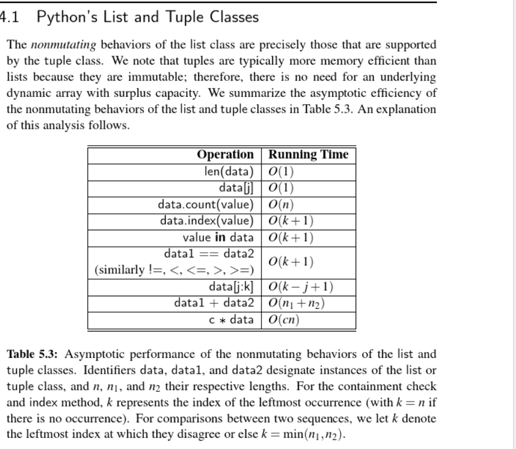

The primary memory of a computer is composed of bits of information, and those bits are typically grouped into larger units, which called as byte. One byte is equivalent to 8 bits. 

## *memory address*

each byte of memory is associated with a unique number that serves as its address. Any byte of the main memory can be efficiently acccessed based upon its memory address. Then, we say that a computer's main memory performs as ***random access memory (RAM)***. An individual byte of memory can be stored or retrieved in O(1) time. 

## *Array*

A group of related variavles which are stored one after another in a contiguous portion of the computer's memory. We refer to each location within an array as a cell, and will use an integer index to describe its location starting with 0. 

Each cell of an array must use the same number of bytes. It allwas an arbitrary cell of the array to be accessed in constant time based on its index. 

## *Runing Time* 
