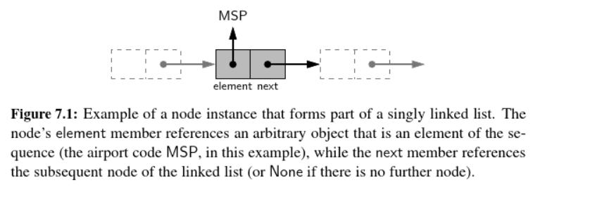
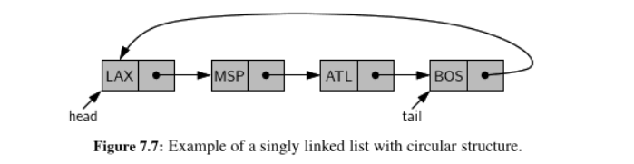
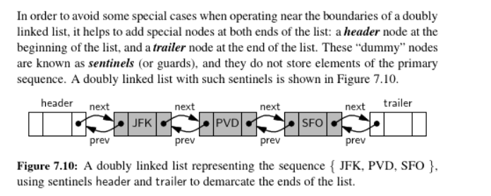

## singly linked list

A collection of nodes that collectively form a linear sequence. Each node stores a reference to an object that is an element of the sequence, as well as a reference to the next node of the list. 

*head* refers to the first node, while *tail* is the last node of a linked list. We can identify the tail as the node having `None` as its next reference. 

A linked list doesn't have a predetermined fixed size like array or queue. It uses space proportionally to its current number of elements. 

## Circularly linked lists 

### Round-Robin Schedulers 
We consider a round-robin scheduler, with iterates through a collection of elements in a circular fashion and "services" each element y performing a given action on it. 

## Doubly Linked Lists 

A linked list in which each node keeps an explicit reference to the node before it and a reference to the node after it. 

*header*: a node at the beginning of the list. It doesn't contain a real element 
*trailer*: a node at the end of the list. It doesn't contain a real element 

- The header and trailer would never change. Only the nodes between them change 
- We can treat all insertions in a unified manner, beacuse a new node will always be placed between a pair of existing adjanct nodes
- 