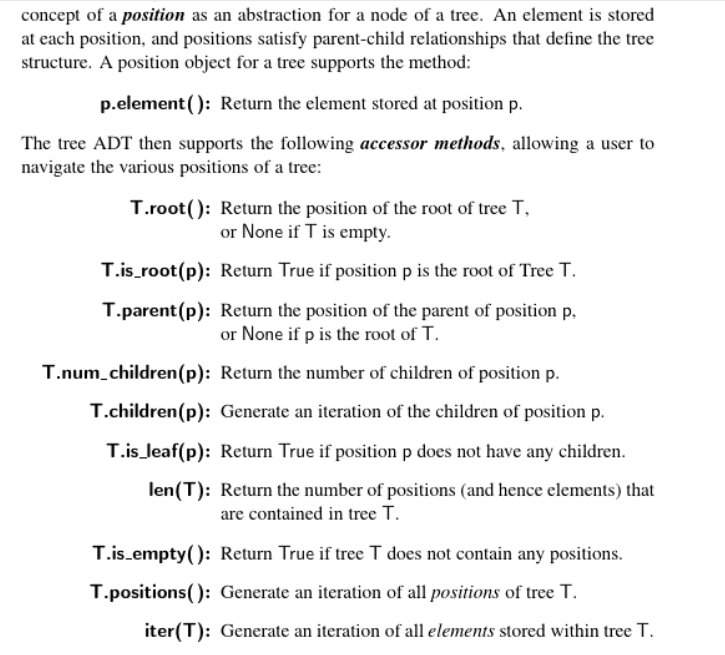

# Chapter 8: Trees

## 8.1.1 General Tree

The relationship in a tree are *hierarchical*, with some objects being 'above' and 'after' relationships between objects. 

With the exception of the top element, each element in a tree has a *parent* element and zero or more *children* elements. We typically call the top element as the *root* of the tree, but it is drawn as the highest elements. 

Formally, we define a ***tree*** `T` as a set of nodes storing elements such that the nodes have a *parent-child* relationship that satisfies the following properties:
1. if `T` is nonempty, it has a special node, called the *root* of `T`, that has no parent 
2. Each node `*v*` of `T` different from the root has a ***unique parent node*** `w`; every node with parent w is a *child* of `w`
3. A tree can be empty, meaning it does not have any nodes. 
4. Two nodes that are children of the same parent are ***sibilings***
5. A node `v` is external if `v` has no children. Also called as leaves
6. A novde `v` is internal if `v` has one or more children 
7. An edge of tree `T` is a pair of nodes `(u,v)` such that `u` is the parent of `v`, or vice versa. 
8. A path of `T` is a sequence of nodes such that any two consecutive nodes in the sequence form an edge. 
9. Ordered Tress: A tree is *ordered* if there is a meaningful linear order among the children of each node. That is, we purposefully identify the children of a node as beging the first, second, third, and so on. Such an order is usually visualized by arranging siblings left to right. 
10. Depth of a node: The number of ancestors of p, excluding p itself. 
    - if p is the root, the depth is 0 
    - Otherwise, the depth of p is 1 + depth of its parent 
11. Height of a node: 
    - if p is a leaf, the height is 0 
    - Otherwise, the hight of p is 1 + maxmimum the heights of p's children 

    1. The highet of a nonempty tree `T` is the hight of the root of `T`. 
    2. The highet of a nonempty tree `T` is equal to the maximum of the depths of its leaf positions. 

## 8.1.2 The Tree Abstract Data Type 

## 8.2 Binary Tree

A binary Tree is an ordered tree with the following properties:
1. Every node has at most two children 
2. Each child node is labeled as being either a left child or a right child 
3. A left child precedes a right child in the orer of children of a node 

A binary tree is proper if each node has either zero or two children. Thus, in a proper binary tree, every internal node has exactly two children. 

For example, a decision tree is a binary tree,. 

